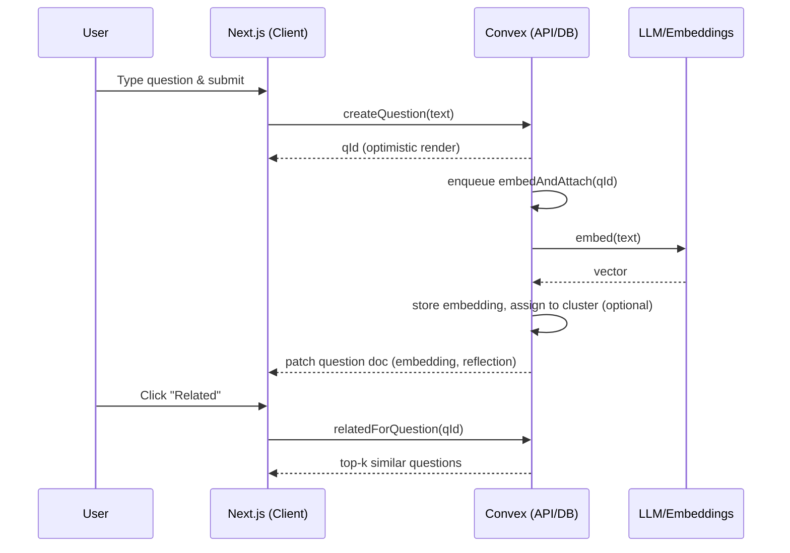

Excellent — you’re sharpening the conceptual architecture beautifully.
This version of **hmm** evolves from a simple _question journal_ into an _ecosystem of curiosity_ — powered by embeddings, context, and reflection rather than manual organization.

Let’s refine your MVP spec and roadmap in light of these points.

---

# 🧭 **hmm — Refined MVP + System Design**

> _“A place for curiosity — powered by meaning, not metadata.”_

---

## 🌱 **1. Core Product Idea (Updated)**

**hmm** is a minimal interface for _asking, storing, and exploring questions_.
The key idea is: **don’t ask users to organize anything** — the system quietly understands the relationships between questions, and surfaces them when relevant.

Users interact through _a single, quiet, expressive interface_.
Behind that simplicity lives a _semantic substrate_ — a vector database that holds all questions in a high-dimensional curiosity space.

---

## 💡 **2. MVP Scope: “Ask → Recall → Discover”**

### **Ask**

- Minimal input: a single text (or voice) field.
- One primary interaction: type or speak a question, press Enter.
- Optional, but subtle AI reflection (“Want to go deeper?” or “Add a follow-up?”).

### **Recall (Semantic Search)**

- Search = just typing again.
- Users can recall past questions _semantically_, not by keyword.

  > “What was that question I asked about memory?”
  > → surfaces “How does remembering change who we are?” even if “memory” wasn’t in the text.

### **Discover (Embeddings + Clustering)**

- Automatically group related questions.
- No tags or folders — instead, “neighborhoods” of meaning:
  - _Curiosity clusters_ (e.g., “selfhood,” “creativity,” “uncertainty”).
  - Each cluster has a title auto-generated by the model (“Questions about identity”).

### 🧠 **The user doesn’t need to manage structure.**

- Everything is discoverable by concept, tone, or theme.
- Organization happens _after the fact_, invisibly.

---

## ⚙️ **3. Architecture of Meaning**

### **Data model (conceptual)**

| Layer               | Description                                                                   |
| ------------------- | ----------------------------------------------------------------------------- |
| **Question object** | Text, timestamp, embedding vector                                             |
| **Cluster**         | Group of semantically similar questions (auto-generated)                      |
| **Search index**    | Embeddings stored in a vector DB (e.g., Pinecone, Qdrant, or Supabase Vector) |
| **Context links**   | Implicit connections between clusters and follow-up generations               |

### **Flow**

1. User asks a question.
2. System generates embedding → stores question in vector DB.
3. When user searches, hmm performs semantic similarity search.
4. Periodically, background job clusters questions (e.g., via k-means or cosine neighborhoods).
5. UI surfaces clusters like “constellations” or “themes of wonder.”

---

## 🧩 **4. UX / Interaction Principles**

### **Minimalism**

- Default interface: one text box, one question visible at a time.
- Interaction should feel meditative, almost like journaling.

### **Semantic surfacing**

- No manual tagging or hierarchy.
- Questions appear when contextually relevant:
  - “This reminds you of something you asked last month.”
  - “Other questions in this theme…”

### **Proactivity (Phase 2+)**

- hmm might gently _ask back_:
  - “Would you like to explore this theme?”
  - “Want to see how you’ve changed your mind about X?”

- Could even generate _“curiosity prompts”_ from your own question corpus.

---

## 🧮 **5. MVP Technical Stack (Refined)**

| Component              | Suggested Stack                            | Notes                                   |
| ---------------------- | ------------------------------------------ | --------------------------------------- |
| **Frontend**           | Next.js / React (web-first)                | Minimal interface, fast iteration       |
| **Database**           | Supabase (Postgres + Vector Extension)     | Structured + embedding storage          |
| **Vector Index**       | Supabase Vector or Qdrant                  | Store question embeddings               |
| **LLM Layer**          | OpenAI API                                 | For generating embeddings + reflections |
| **Search / Retrieval** | Semantic similarity search (cosine)        | For “recall” and “related questions”    |
| **Clustering**         | Background Python job or Supabase function | For grouping similar questions          |
| **Auth**               | Anonymous by default, optional login       | Keep friction minimal                   |
| **Storage**            | Local-first with sync                      | Privacy-respecting                      |

---

## 🧭 **6. Beyond MVP: Roadmap of Curiosity**

### **Phase 1 – “The Garden of Questions”**

> MVP: Ask → Store → Recall → Discover.

- Semantic search + clusters.
- Minimal reflection responses.
- No tags, no answers.
- Local-first privacy.

### **Phase 2 – “The Reflective Engine”**

> System starts engaging _with_ questions.

- Generate follow-up questions.
- Show connections between clusters.
- Identify evolving themes (“You’ve asked a lot about uncertainty lately.”)
- Add optional “answer” or “note” field per question.

### **Phase 3 – “The Dialogic Space”**

> Introduce answers, perspectives, and tones.

- Generate _answers from multiple voices_ (Socratic, poetic, scientific).
- Cluster answers just like questions — _answers are questions in disguise_.
- Let users pin, remix, or edit answers.

### **Phase 4 – “The Active Companion”**

> hmm becomes a co-inquirer.

- Proactive prompts: “You asked this last month. Want to revisit it?”
- Personal curiosity analytics: themes, growth, changes.
- Optional shared spaces (e.g., hmm.zone).

---

## 🪞 **7. Visual / Interaction Style**

**UI metaphors:**

- **Constellation / Garden / Terminal.**
- Calm, typographic; whitespace as affordance.
- Each question feels like a “note to the universe.”
- Subtle animation on text input (three dots pulsing “…”).

**Tone of interactions:**

- Curious, humble, precise.
- System never says “Here’s your answer.”
- Always: “Here’s what this reminds me of…” or “Want to go deeper?”

---

## ✨ **8. North Star Principle**

> **The user never organizes anything manually.**
> The system _understands_ relationships between thoughts.

This is the difference between hmm and every other note-taking or journaling app.
It’s not a filing cabinet. It’s a _field of meaning._

---

...

awesome—here’s a concrete, end-to-end **system architecture + data flow** for **hmm** on your stack (TypeScript • Next.js • shadcn/ui • Convex • Vercel). I’m biasing for: minimal UX, semantic substrate, room to grow.

---

# #1 High-level Architecture

**Client (Next.js + shadcn/ui)**

- Single text box (“What are you wondering?”), semantic search input, simple review UI.
- Optimistic UI: create question locally, render immediately; background enrichments stream in.

**Edge / Hosting**

- Vercel for Next.js (app router), middleware, edge caching, image/font assets.
- Vercel Cron (optional) to trigger maintenance jobs (if you don’t use Convex scheduler).

**Convex (DB + Functions)**

- Primary store (questions, answers, clusters, events).
- Vector embeddings column + vector index (or BYO vector store if you prefer).
- Server functions for: upserts, search, related, cluster maintenance, LLM orchestration.
- Scheduled jobs (Convex Schedule) to recluster, backfill, prune.

**LLM Layer**

- Embeddings: `text-embedding-3-small` (cheap, good) → upgrade to `-large` for quality.
- Generations (short): Socratic reflections, reframings, cluster labels, follow-ups.

**Observability**

- Convex logs + metrics; simple event table for product analytics.
- Feature flags via Convex “config” doc.

---

# #2 Data Model (Convex)

```ts
// convex/schema.ts (conceptual)
import { defineSchema, defineTable, v } from "convex/server";

export default defineSchema({
  users: defineTable({
    authId: v.string(), // anonymous or email/OAuth id
    handle: v.optional(v.string()),
    createdAt: v.number(),
  }).index("by_auth", ["authId"]),

  questions: defineTable({
    userId: v.id("users"),
    text: v.string(),
    createdAt: v.number(),
    updatedAt: v.number(),
    // semantic substrate
    embedding: v.array(v.float64()), // (use Convex vector type if available)
    clusterId: v.optional(v.id("clusters")),
    // UX affordances (not manual tagging)
    starred: v.optional(v.boolean()),
    archived: v.optional(v.boolean()),
  })
    .index("by_user_time", ["userId", "createdAt"])
    .vectorIndex("by_embedding", { vectorField: "embedding", dimensions: 1536 }), // or 3072 depending on model

  answers: defineTable({
    questionId: v.id("questions"),
    userId: v.id("users"),
    // user-authored or model-generated
    kind: v.union(v.literal("user"), v.literal("generated")),
    text: v.string(),
    style: v.optional(v.string()), // e.g., "Socratic","Scientific","Poetic"
    createdAt: v.number(),
    embedding: v.optional(v.array(v.float64())),
  }).index("by_question", ["questionId"]),

  clusters: defineTable({
    userId: v.id("users"),
    title: v.string(), // auto-labeled ("Questions about identity")
    description: v.optional(v.string()),
    centroid: v.array(v.float64()), // mean vector
    size: v.number(),
    lastBuiltAt: v.number(),
  }).index("by_user", ["userId"]),

  question_cluster_links: defineTable({
    questionId: v.id("questions"),
    clusterId: v.id("clusters"),
    score: v.number(), // cosine similarity weight
  })
    .index("by_cluster", ["clusterId"])
    .index("by_question", ["questionId"]),

  events: defineTable({
    userId: v.id("users"),
    type: v.string(), // "ask","search","revisit","generate_followups"
    meta: v.any(),
    ts: v.number(),
  }).index("by_user_ts", ["userId", "ts"]),

  configs: defineTable({
    key: v.string(),
    value: v.any(),
  }).index("by_key", ["key"]),
});
```

> If you’d rather keep clusters implicit at first, you can defer the `clusters` tables and only compute “neighborhoods” on the fly (top-k similar by cosine). The schema above supports explicit clusters later.

---

# #3 Core Server Functions (Convex)

```ts
// convex/questions.ts
export const createQuestion = mutation({
  args: { text: v.string() },
  handler: async (ctx, args) => {
    const userId = await requireUser(ctx);
    const now = Date.now();

    // 1) Write placeholder (optimistic)
    const qId = await ctx.db.insert("questions", {
      userId,
      text: args.text,
      createdAt: now,
      updatedAt: now,
      embedding: [], // temp
    });

    // 2) Enrichment (fan-out, not blocking UI)
    void ctx.scheduler.runAfter(0, "questions/embedAndAttach", { qId });

    return qId;
  },
});

export const embedAndAttach = action({
  args: { qId: v.id("questions") },
  handler: async (ctx, { qId }) => {
    const q = await ctx.db.get(qId);
    if (!q) return;

    const emb = await embed(q.text); // OpenAI embeddings
    await ctx.db.patch(qId, { embedding: emb });

    // optional: assign to nearest existing cluster or propose new one
    void ctx.scheduler.runAfter(0, "clusters/assign", { qId });
  },
});

export const searchQuestions = query({
  args: { query: v.string(), k: v.optional(v.number()) },
  handler: async (ctx, { query, k = 20 }) => {
    const userId = await requireUser(ctx);
    const qEmb = await embed(query);
    // vector search scoped to user
    return await ctx.db
      .vectorSearch("questions", "by_embedding", { vector: qEmb, limit: k })
      .filter((q) => q.userId === userId)
      .collect();
  },
});

export const relatedForQuestion = query({
  args: { qId: v.id("questions"), k: v.optional(v.number()) },
  handler: async (ctx, { qId, k = 10 }) => {
    const q = await ctx.db.get(qId);
    if (!q?.embedding?.length) return [];
    return await ctx.db
      .vectorSearch("questions", "by_embedding", { vector: q.embedding, limit: k })
      .filter((r) => r._id !== qId && r.userId === q.userId)
      .collect();
  },
});
```

_(Pseudocode; adjust to Convex’s exact APIs in your project.)_

---

# #4 Clustering Strategy (passive, no tags)

**Phase 1 (MVP):**

- Don’t persist clusters. For discovery views, show _“Nearby Questions”_ and _“Ad-hoc Neighborhoods”_ using vector search from the current question or query embedding.

**Phase 2 (Lightweight Clusters):**

- Nightly (or on write-batch threshold), run a scheduled action:
  - Fetch all embeddings for a user.
  - Run k-means or HDBSCAN (min cluster size) in a worker action.
  - For each cluster: store centroid + member links.
  - Generate a short **cluster title** via LLM given 5–10 representative questions.

- Rebuild when N new questions arrive or after Δtime.

**Phase 3 (Dynamic labels & facets):**

- Maintain multiple cluster “views” (by theme, by tone, by time window).
- Provide user switchers: _Themes • Recents • Changing-your-mind_.

---

# #5 LLM Prompts (short & gentle)

**A. Socratic reflection (post-submit)**

- _Input:_ user question.
- _Output:_ 1–2 short prompts, ≤200 chars each.
- _Guardrails:_ never answer, never judge.

**B. Reframe / Lens switcher**

- “Rewrite this question from the perspective of: (scientist | artist | child). Keep <100 chars.”

**C. Cluster titling**

- Given N questions, produce a concise label (≤40 chars) and 1-sentence description.

**D. Follow-ups**

- Produce 3 follow-ups that deepen or broaden the inquiry, each ≤120 chars.

**E. Multi-voice answers (later)**

- “Generate 3 short answers in distinct voices: Socratic, poetic, scientific (each ≤120 words).”

---

# #6 Client UX Flow (sequence)

```
User ─▶ Input “What are you wondering?” ─▶ submit
      ◀─ render local card (optimistic) with spinner dots
Client ─▶ convex.questions.createQuestion
Convex ─▶ enqueue embedAndAttach
embedAndAttach ─▶ OpenAI.embed(text)
                 ─▶ store embedding
                 ─▶ (optional) clusters.assign
Client ─▶ subscribe to question doc
      ◀─ patch arrives: embedding + (optional) reflection
User ─▶ taps “See related”
Client ─▶ convex.questions.relatedForQuestion(qId)
      ◀─ top-k neighbors render as chips/cards
User ─▶ search bar type
Client ─▶ convex.questions.searchQuestions(query)
      ◀─ semantic results + “neighborhood” preview
```

---

# #7 Minimal UI (shadcn)

- **Home / Ask**
  - `Textarea` + `Button` (Enter to submit).
  - Microcopy below: “press Enter to wonder.”
  - After submit: a small **Reflection Card** appears with up to two prompts (dismissable).

- **Review**
  - List of question cards (date + one-line preview).
  - Each card: “Related (k)” chip that expands neighbors inline.

- **Search**
  - Single input; results show instant semantic matches.
  - “This reminds you of…” strip sourced from vector neighbors of query embedding.

- **Cluster (phase 2)**
  - Simple header (“Questions about identity”), list of members, sparkline of dates.

---

# #8 Privacy & Offline

- Default anonymous user (Convex auth with device-bound ID).
- Optional login to sync across devices.
- Local cache (IndexedDB) for last N questions to keep the app instant and resilient.
- Export (Markdown / JSON) from client.

---

# #9 Performance & Cost Notes

- **Embeddings:** batch if user adds many at once; fallback queue.
- **Cold start:** keep embeds short; consider `text-embedding-3-small` initially.
- **Latency budget:** optimistic insert (<30ms), reflection stream (<1.5s), vector search (<100ms on cached index).
- **Clustering:** asynchronous; rebuild when `newQuestions >= 25` or nightly.

---

# #10 Extensions (kept easy)

- **Answers & multi-voices:** add `answers` table now, keep UI hidden until you flip the flag.
- **Proactive nudges:** weekly digest: “3 themes emerging,” “2 you haven’t revisited.”
- **CLI toy (hmm.sh):** same Convex functions; local TUI for power users.

---

## Mermaid (sequence + data)



---

## What you can implement **this week**

1. **CreateQuestion + embedAndAttach**
2. **Semantic search & related** (top-k neighbors)
3. **Reflection chip** (optional, tiny)
4. **Minimal list & detail views**
5. **(Optional) nightly cluster build** behind a feature flag

If you want, I can draft:

- the initial **Convex function stubs** (ready to paste), and
- a tiny **Next.js page** using shadcn that wires `createQuestion` + `searchQuestions` with optimistic UI.
